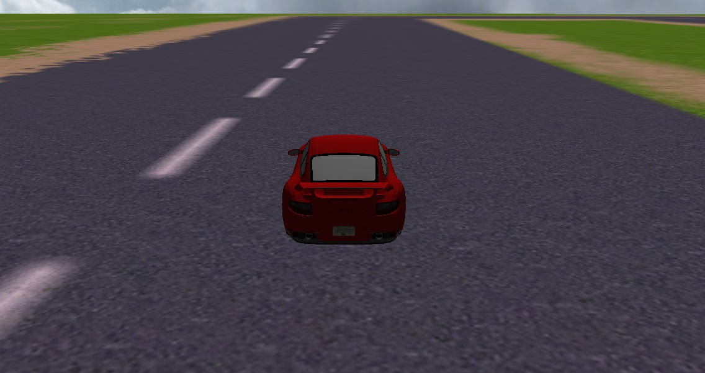
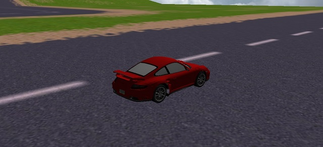
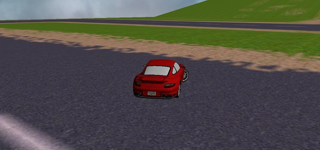
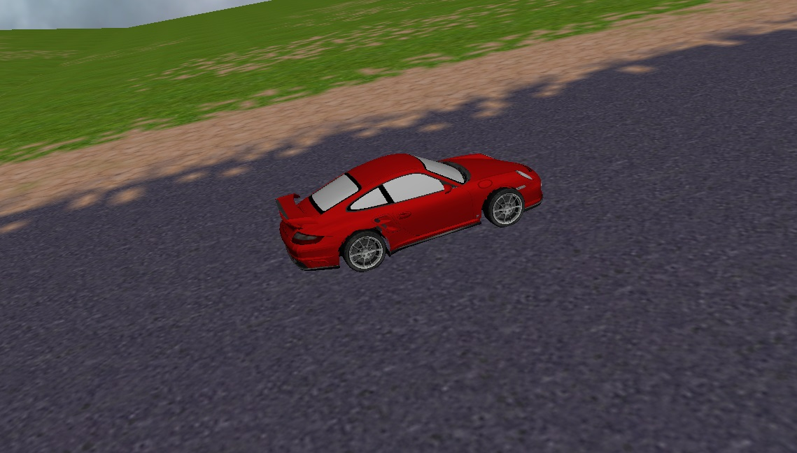
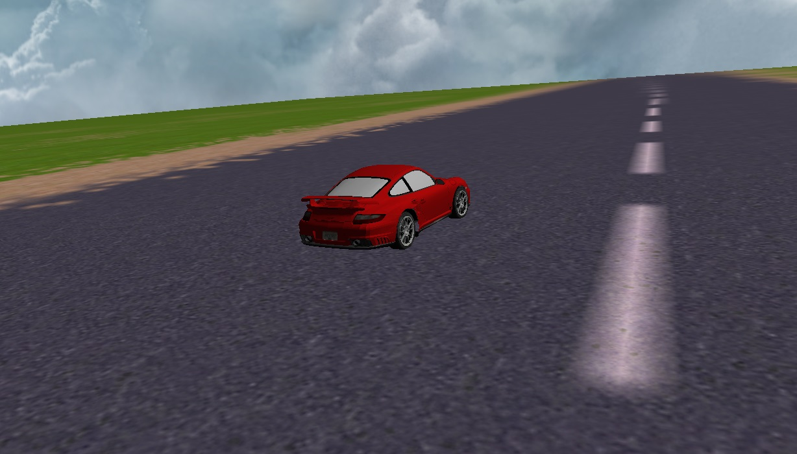
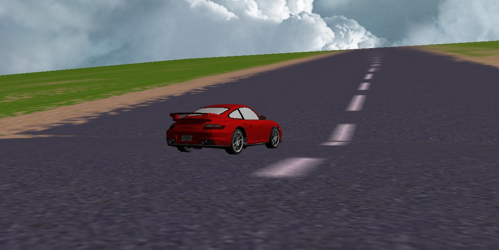

# Car Simulation LWJGL

A project to simulate the physics of car movement - Damascus University, third year, 2019.

## Overview

The goal of this project is to simulate car movement by applying physical laws.
The project is built using Lightweight Java Game Library ([LWJGL](https://www.lwjgl.org/)).

## Features
- Multiple physical forces are applied.
  - Engine force.
  - Brake force.
  - Rolling friction force.
  - Air resistance force.
- OpenGL Shaders.
- Used external textures and a model for the car.

## Installation
First you should clone the project and extract the required jar files.

```shell
  git clone https://github.com/abdulrahmanKanakri/car-simulation-lwjgl.git
  cd car-simulation-lwjgl
  unzip jars.zip && rm jars.zip
```

Second you should download the [settings widget application](https://github.com/abdulrahmanKanakri/car-simulation-settings-widget)
to change the initial values of the simulation environment

```shell
  git clone https://github.com/abdulrahmanKanakri/car-simulation-settings-widget.git
```

## How to use

After the installation, you should run the settings widget app first,
then run the simulation project from engineTester/MainGameLoop.java


## Screenshots
||||
|---|---|---|
||||
||||
